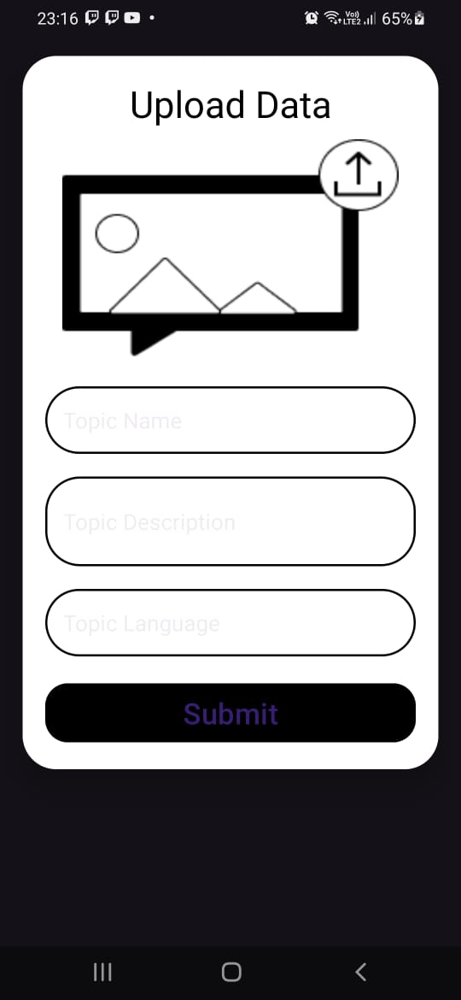
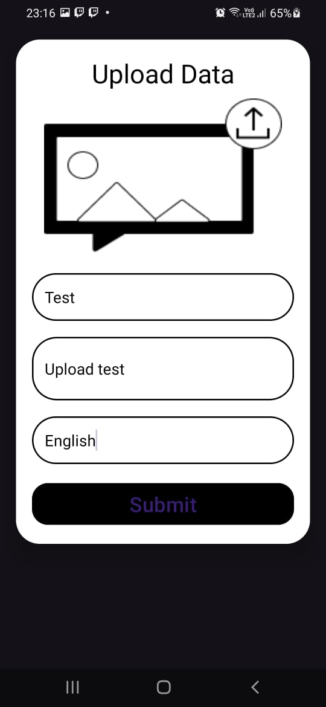

## CRUD Prototype - Android App

This project is a CRUD (Create, Read, Update, Delete) prototype application for Android. It allows users to view, search, and add data entries to a Firebase Realtime Database.

### Features

* **View data**: Retrieve and display data entries from a Firebase Realtime Database.
* **Search data**: Search for specific data entries by title.
* **Add data**: Navigate to a separate activity to add new data entries.

### Dependencies

* AndroidX libraries (androidx.*)
* Firebase Realtime Database
* Glide (optional, for image loading)

### Setting Up

1. Clone this repository.
2. Install the necessary dependencies. You can use Android Studio to do this automatically.
3. Configure your Firebase project and enable Realtime Database.
4. Update the reference path in `databaseReference` to point to your desired location in the database.

### Running the App

1. Open the project in Android Studio.
2. Ensure you have a connected Android device or emulator.
3. Run the app.

### Code Breakdown

* **MainActivity.java**: This class handles the main activity of the app. It initializes the UI elements, retrieves data from Firebase, and implements search functionality.
* **DataClass.java**: This class defines the data structure of each entry in the database. (Modify this class to match your specific data format)
* **MyAdapter.java**: This class is a custom adapter used to display data entries in a RecyclerView. (Modify this class to handle your data view)
* **UploadActivity.java**: (Not provided) This class likely handles adding new data entries. (Implement this activity based on your needs)

### Screenshots

